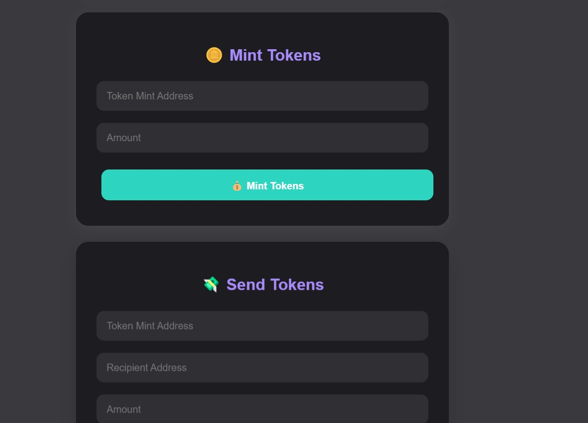

# ⚡ Solana Wallet App

> A sleek React + Tailwind CSS application built on the **Solana blockchain** allowing users to connect Phantom wallets, create and mint tokens, send tokens, and view transaction history — all with a beautifully modern UI.




---

## 🚀 Tech Stack

- **Frontend:** React.js, Tailwind CSS
- **Blockchain:** Solana Web3.js, Phantom Wallet Integration
- **Token Utilities:** @solana/spl-token
- **UI Enhancements:** Glassmorphism, Responsive Grid Layout, CSS Variables

---

## ✨ Features

- 🔐 Connect Phantom Wallet securely
- 🪙 Create and mint your own SPL tokens
- 💸 Send tokens to other wallets
- 📜 Transaction history with explorer links
- 📱 Fully responsive modern UI with animated effects
- 🌗 Light/Dark theme support via system preference

---

## 🔧 Installation & Setup

### 1. Clone the Repository

```bash
git clone https://github.com/your-username/solana-wallet-app.git
cd solana-wallet-app
```

### 2. Install Dependencies

```bash
npm install
```

### 3. Run the App

```bash
npm start
```

The app will run locally at `http://localhost:3000`.

---

## 📸 UI Screenshots

### 🧩 Connect Wallet Screen


### 💰 Token Management Panel


### 📊 Transaction History


---

## 🌐 Environment Variables

No custom `.env` is required unless you're integrating further backend features.

---

## 📁 Folder Structure

```
src/
│
├── assets/         # Icons and images
├── components/     # UI components (WalletModal, TokenCard, TxList, etc.)
├── contexts/       # Wallet context provider
├── pages/          # Main views (Dashboard, Connect)
├── styles/         # Tailwind & custom CSS
└── App.js          # Main application entry
```

---

## 🔗 Useful Links

- [Solana Docs](https://docs.solana.com/)
- [Phantom Wallet](https://phantom.app/)
- [Solana Explorer](https://explorer.solana.com/)

---

## 🤝 Contributing

1. Fork the repository  
2. Create your branch: `git checkout -b feature-name`  
3. Commit changes: `git commit -m "Add feature"`  
4. Push branch: `git push origin feature-name`  
5. Submit a Pull Request

---

## 📄 License

This project is licensed under the [MIT License](LICENSE).
